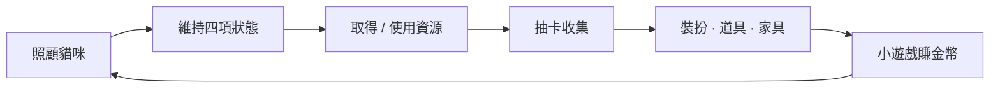
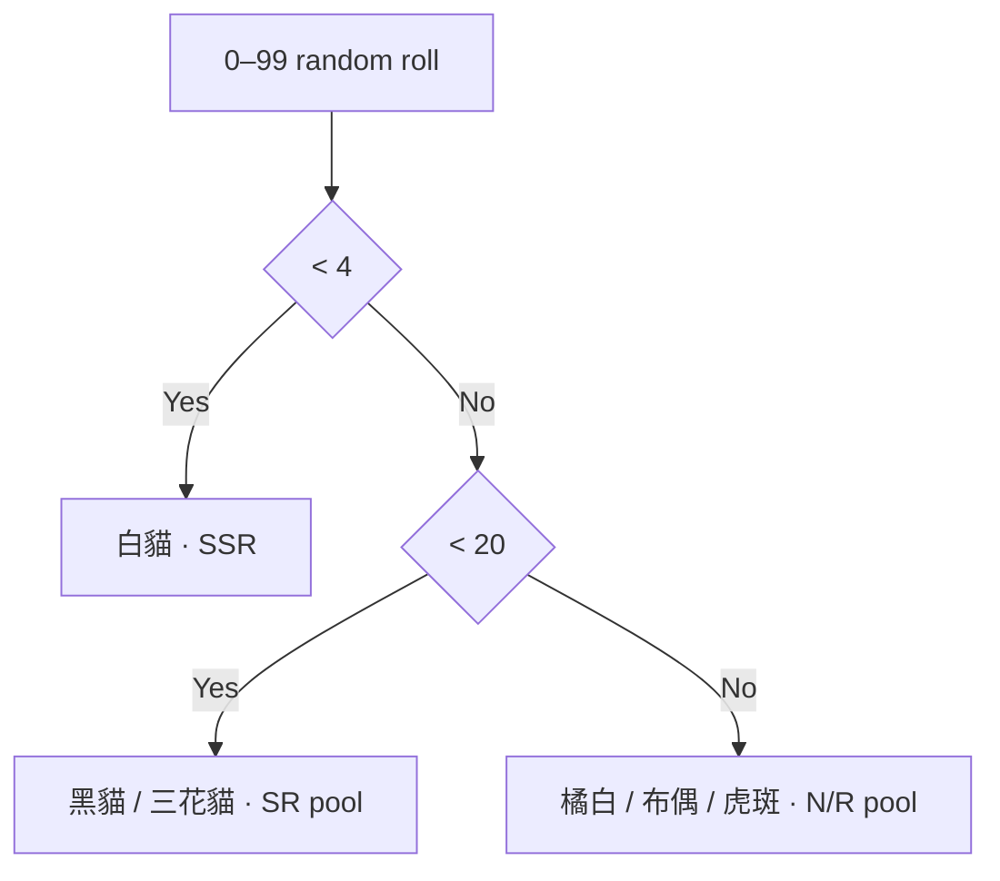
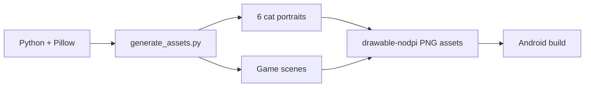
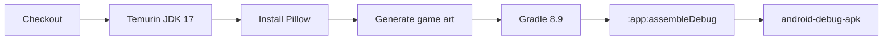

<div align="center">

# 🐾 CuteCat · 喵喵小屋

### Native Android virtual-pet game · gacha · care · dress-up · build-generated art

一個用原生 Android / Java 做成的貓咪養成 MVP：抽卡、照顧、裝扮、收藏、家具、小遊戲與隱藏管理員模式，都集中在一個可直接由 GitHub Actions 打包的 debug APK。

[](https://github.com/jerry0327/cutecat/actions/workflows/android-debug-apk.yml)


**[遊戲內容](#遊戲內容)** · **[抽卡](#抽卡系統)** · **[美術生成](#build-generated-art)** · **[APK](#apk-build)**

</div>

---

## 遊戲定位

CuteCat 是一個小型 **virtual pet / collection game**。目前版本把完整 MVP loop 放在單一原生 Android app 中：



目前沒有後端、登入或雲端經濟系統；遊戲狀態直接存在 Activity runtime 內，因此它定位為 **可玩的 preview / architecture MVP**，而不是已完成的長期 live-service game。

## 遊戲內容

### 6 隻可抽角色

| Rarity | Cat |
| --- | --- |
| N | 橘白貓 |
| R | 奶油布偶貓 |
| R | 灰虎斑貓 |
| SR | 黑貓 |
| SR | 三花貓 |
| SSR | 白貓 |

每隻貓都有目前等級與四個照顧指標：

- 🍗 **飽足**
- 💗 **心情**
- 🛁 **清潔**
- ⚡ **活力**

照顧頁可分別用餵食、洗澡、陪玩與睡覺回復對應狀態，單次增加 15，最高 100。

### 資源經濟

目前 runtime 內有：

- 金幣
- 鑽石
- 抽卡券
- 貓咪等級

單抽優先消耗 1 張抽卡券；券不足時改以 150 鑽石 / 抽計算。十連抽使用相同規則乘以 10。

### Collection pages

目前已經有獨立入口展示：

- 🎀 裝扮：蝴蝶結、紳士帽、魔法帽、藍圍巾、眼鏡、水手服、小披風、花環
- 🎁 道具：貓糧、魚罐頭、毛線球、逗貓棒、浴巾、寶箱、愛心、抽卡券
- 🛋️ 家具：沙發、貓跳台、小床、浴缸、花園、扭蛋機、衣櫃、小夜燈

這些頁面目前是 collection-oriented MVP，尚未實作完整 equip / inventory persistence。

## 抽卡系統

目前 `MainActivity` 的實際抽卡分布是：



也就是：

- **4%** 進入 SSR 白貓
- **16%** 進入兩隻 SR pool
- **80%** 進入前三隻 N/R pool

> [!NOTE]
> 這是目前 preview code 的實際邏輯，不代表最終遊戲平衡設定。

## 毛線球小遊戲

目前的小遊戲是簡化版互動：按下「拍貓掌」即可增加金幣。

- 一般模式：+50 金幣
- Admin 模式：+100 金幣

它先驗證「遊戲內活動 → 資源 → 養成」的 loop，之後可以再替換成更完整的 timing / reflex mini-game。

## 隱藏管理員模式

右上設定入口連點 **7 次**後會開啟 admin page：

- 一次補充大量金幣 / 鑽石 / 抽卡券
- 將四個照顧狀態直接補滿
- 小遊戲獎勵提高

這是一個實際存在於 runtime 的隱藏測試入口，方便快速驗證 collection / care flow。

## Build-generated art

這個 repo 最特別的地方之一，是主要 PNG 遊戲素材**不是只作為不可追溯的 binary 丟進 repository**。

`tools/generate_assets.py` 使用 Pillow 在 build 階段產生：

- 6 張貓咪 portrait
- `hero_scene`
- `gacha_scene`
- `items_scene`
- `room_scene`



生成器內直接定義角色顏色、耳朵、眼睛、patch、背景漸層、卡片與場景幾何，因此 CI 可以從 source 重新建立整套 preview art。

## APK Build

GitHub Actions 會在 push / PR / manual dispatch 時執行：



Artifact 目前保留 **14 days**。

### 下載 APK

1. 進入 repository 的 **Actions**。
2. 開啟最新的 **Build Android Debug APK** run。
3. 在 Artifacts 下載 `android-debug-apk`。
4. 解壓縮取得 `cutecat-debug.apk`。
5. Android 裝置若有提示，需允許安裝未知來源 App。

## Local build

目前 Android 設定：

| Setting | Value |
| --- | --- |
| Application ID | `com.jerry0327.cutecat` |
| minSdk | 26 |
| targetSdk | 35 |
| compileSdk | 35 |
| Java | 17 |
| versionName | `1.0.0-preview` |

先產生美術素材，再 build APK：

```bash
pip install pillow
python tools/generate_assets.py
gradle --no-daemon :app:assembleDebug
```

輸出：

```text
app/build/outputs/apk/debug/app-debug.apk
```

## Repository anatomy

```text
app/src/main/java/com/jerry0327/cutecat/
└── MainActivity.java        game state, navigation, gacha, care, collections

app/src/main/res/
├── drawable/               launcher vector
└── values/                 strings / styles

tools/
└── generate_assets.py      reproducible cat / scene PNG generator

.github/workflows/
└── android-debug-apk.yml   asset generation + APK build pipeline
```

## 下一步可以擴充什麼

目前 source structure 最自然的下一階段是：

- 將 game state 從 Activity memory 抽成 persistence layer
- 真正的 inventory / equip / furniture placement state
- collection / achievement book
- 每日任務與成就
- 更完整的小遊戲
- 音效 / BGM
- signed APK / AAB release flow

---

<div align="center">

### 🐈 build a cat · raise a cat · collect a cat

**CuteCat / 喵喵小屋**

</div>
